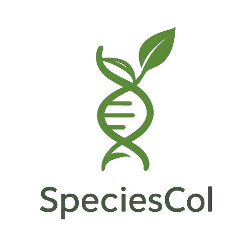
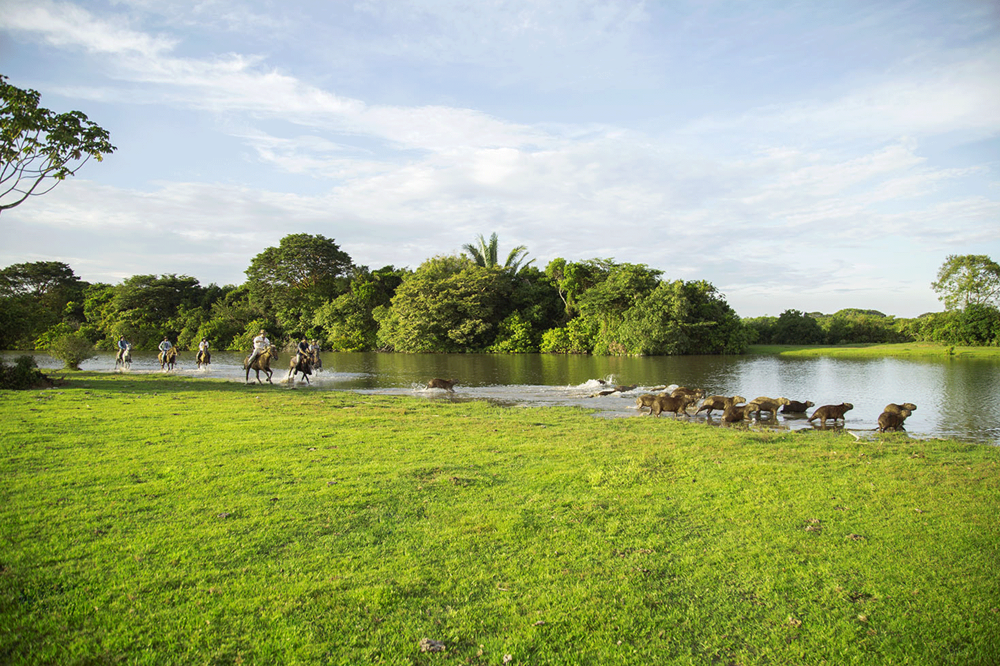
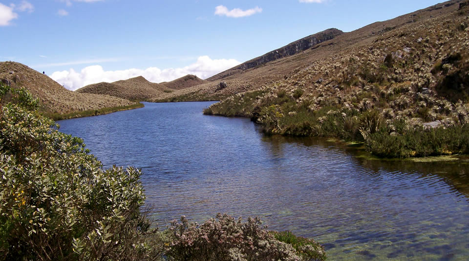
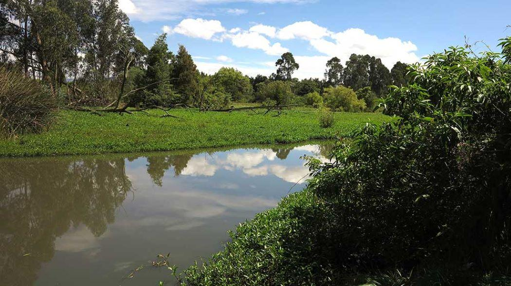

# SpeciesCol

<div align="center">
  
  <h3>Plataforma educativa para visibilizar la biodiversidad colombiana</h3>
  <p><b>Tecnologia + Educacion + Conservacion</b></p>

  
  
  
  
  
  
</div>

---

## Presentado por

- Cristian Eduardo Carvajal Izquierdo
- Ronald Neomar Tapias Rojas
- Sergio Alejandro Uribe Montealegre

---

## Tabla de contenido

- [Resumen ejecutivo](#resumen-ejecutivo)
- [Introduccion](#introduccion)
- [Objetivo general y objetivos especificos](#objetivo-general-y-objetivos-especificos)
- [Como acceder al proyecto](#como-acceder-al-proyecto)
- [Vistas y funcionalidades principales](#vistas-y-funcionalidades-principales)
- [Arquitectura de la aplicacion](#arquitectura-de-la-aplicacion)
- [Stack tecnologico](#stack-tecnologico)
- [Instalacion y ejecucion local paso a paso](#instalacion-y-ejecucion-local-paso-a-paso)
- [Despliegue](#despliegue)
- [Planteamiento del problema](#planteamiento-del-problema)
- [Antecedentes](#antecedentes)
- [Marco teorico](#marco-teorico)
- [Normatividad](#normatividad)
- [Materiales y equipos](#materiales-y-equipos)
- [Metodologia](#metodologia)
- [Poblacion y muestra](#poblacion-y-muestra)
- [Resultados](#resultados)
- [Conclusiones](#conclusiones)
- [Hoja de ruta futura](#hoja-de-ruta-futura)
- [FAQ](#faq)
- [Referencias bibliograficas](#referencias-bibliograficas)
- [Licencia](#licencia)

---

## Resumen ejecutivo

SpeciesCol es una aplicacion web educativa, interactiva y responsive orientada a la divulgacion de informacion sobre especies extintas y en peligro de extincion en Colombia.

El proyecto integra:

- fichas tecnicas de especies
- contexto de biomas y regiones
- noticias ambientales
- modulo educativo de cuidado y ODS

Su finalidad es facilitar el aprendizaje, promover conciencia ambiental y fortalecer la relacion entre conocimiento cientifico, memoria historica y accion ciudadana.

<div align="center">
  
  
  
</div>

---

## Introduccion

La perdida de biodiversidad es una de las problematicas ambientales mas criticas del siglo XXI. En Colombia, la reduccion de especies y el aumento de taxones amenazados afecta el equilibrio ecologico y tambien impacta la memoria cultural de comunidades que han convivido historicamente con esa fauna y flora.

SpeciesCol propone una experiencia web clara y accesible para centralizar informacion confiable sobre biodiversidad, con recursos visuales e interactivos para facilitar comprension, apropiacion del conocimiento y sensibilizacion.

---

## Objetivo general y objetivos especificos

### Objetivo general

Desarrollar una aplicacion web que documente y divulgue informacion veridica sobre especies extintas y en peligro de extincion de Colombia, promoviendo la culturizacion historica y ambiental.

### Objetivos especificos

- Estructurar un repositorio con mas de 15 fichas de especies extintas o amenazadas, incluyendo datos clave y bibliografia.
- Diseñar recursos pedagogicos digitales accesibles y faciles de comprender.
- Construir una UI responsive alineada con criterios de accesibilidad WCAG 2.2 AA en las vistas clave.

---

## Como acceder al proyecto

### Opcion 1: abrir directamente

1. Entra a la carpeta del proyecto.
2. Abre el archivo `index.html` con tu navegador.

### Opcion 2: servidor local recomendado

Usar un servidor evita problemas de rutas en algunos navegadores.

1. Abre una terminal en la carpeta del proyecto.
2. Ejecuta:

```bash
python -m http.server 5500
```

3. Abre en tu navegador:

```text
http://localhost:5500
```

### Rutas de navegacion dentro del sitio

- Inicio: `index.html`
- Especies: `especies.html`
- Noticias: `noticias.html`
- Cuidado: `cuidado.html`

---

## Vistas y funcionalidades principales

### 1) Inicio

- Hero dinamico con imagenes rotativas.
- Mapa SVG interactivo de Colombia por departamentos/regiones.
- Seccion de biomas y contenido contextual.

### 2) Especies

- Catalogo de especies con tarjetas informativas.
- Fichas ampliadas con estado de conservacion, habitat y descripcion.
- Integracion de datos enriquecidos para divulgacion.

### 3) Noticias

- Noticias ambientales de interes nacional e internacional.
- Tarjetas de lectura y bloque destacado.

### 4) Cuidado

- Seccion educativa con ODS.
- Tips de accion ambiental cotidiana.
- Recursos para fortalecer cultura de conservacion.

<div align="center">
  
  
  
</div>

---

## Arquitectura de la aplicacion

```text
speciescol1/
|-- index.html
|-- especies.html
|-- noticias.html
|-- cuidado.html
|-- css/
|   |-- styles.css
|   |-- mapa-departamentos.css
|   |-- especies.css
|   |-- noticias.css
|   |-- cuidado.css
|-- js/
|   |-- script.js
|   |-- mapa-departamentos.js
|   |-- especies.js
|   |-- noticias.js
|   |-- cuidado.js
|-- img/
|-- README.md
```

### Criterio de organizacion

- HTML en raiz para acceso rapido.
- CSS centralizado por modulo en `css/`.
- JS modularizado por vista en `js/`.
- Recursos graficos en `img/`.

---

## Stack tecnologico

| Capa | Tecnologia | Uso |
|---|---|---|
| Estructura | HTML5 | Maquetacion de vistas |
| Estilos | CSS3 + Bootstrap 5 | Diseno responsive y componentes UI |
| Interaccion | JavaScript ES6 | Logica de vistas e interactividad |
| Visualizacion | SVG + imagenes | Mapa y recursos pedagogicos |
| Datos | JSON + APIs abiertas | Fichas y contenidos dinamicos |
| Control de versiones | Git + GitHub | Historial y colaboracion |

---

## Instalacion y ejecucion local paso a paso

### Prerrequisitos

- Navegador moderno: Chrome, Edge o Firefox
- Python 3.x (opcional, para servidor local)

### Ejecucion rapida

```bash
git clone https://github.com/Thesergio3434xd-1/SpeciesCol.git
cd SpeciesCol
python -m http.server 5500
```

Abrir en navegador:

```text
http://localhost:5500
```

### Verificacion de funcionamiento

Checklist sugerido:

- Navbar funcional en las 4 vistas
- Carga de imagenes locales desde `img/`
- Carga de estilos desde `css/`
- Carga de scripts desde `js/`
- Mapa interactivo visible en la pagina de inicio

---

## Despliegue

### GitHub Pages (recomendado)

1. Ir al repositorio en GitHub.
2. Abrir `Settings`.
3. Ir a `Pages`.
4. En `Source`, elegir `Deploy from a branch`.
5. Seleccionar rama `main` y carpeta `/ (root)`.
6. Guardar y esperar publicacion.

### Otras opciones

- Netlify (arrastrar carpeta o conectar repo)
- Vercel en modo estatico

---

## Planteamiento del problema

Distintos reportes cientificos alertan sobre la degradacion de biodiversidad a escala global y local. En paralelo, existe interes ciudadano por participar en acciones ambientales, pero persiste una brecha de acceso a informacion clara, centralizada y didactica.

Pregunta orientadora del proyecto:

> Es posible aprender y reconocer especies extintas o en riesgo de extincion de forma interactiva y centralizada en un unico sitio web?

SpeciesCol responde a esa necesidad con una experiencia digital enfocada en educacion ambiental y apropiacion social del conocimiento.

---

## Antecedentes

El proyecto se soporta en antecedentes de conservacion y tecnologia:

- IA aplicada a monitoreo de fauna.
- Plataformas de ciencia participativa y seguimiento comunitario.
- Soluciones de aprendizaje digital para reservas y turismo educativo.
- Iniciativas publico-privadas para proteccion de biodiversidad en Colombia.

---

## Marco teorico

### Estados de conservacion

Uso de categorias UICN para comunicar nivel de amenaza:

- EX, EW, CR, EN, VU, NT, LC, DD, NE

### Motores de riesgo

- cambio de uso del suelo
- sobreexplotacion
- especies invasoras
- contaminacion
- cambio climatico
- patrones de consumo no sostenibles

### Valor ecosistemico

La biodiversidad sostiene servicios de provision, regulacion, soporte y valor cultural, con impacto directo en salud, economia y resiliencia territorial.

### Conservacion y accion

Se consideran medidas in situ y ex situ, enfoque de mejora continua e integracion de evidencias para toma de decisiones.

### Accesibilidad y UX

Se prioriza navegacion clara, lectura comprensible, consistencia visual y foco en usabilidad inclusiva bajo lineamientos WCAG 2.2.

---

## Normatividad

Referentes legales considerados:

- Ley 1774 de 2016
- Ley 2111 de 2021 (Articulo 329)
- Ley 2153 de 2021
- Ley 1712 de 2014
- Ley 1581 de 2012

---

## Materiales y equipos

### Recursos tecnologicos

- HTML5, CSS3, JavaScript
- Bootstrap y Bootstrap Icons
- Datos en JSON y consumo de APIs abiertas
- GitHub para control de versiones

### Recursos fisicos

Desarrollo en portatiles de gama media con capacidad suficiente para maquetacion, codificacion, pruebas funcionales y ajustes visuales.

---

## Metodologia

Enfoque cuantitativo con dos frentes principales:

- Encuesta estructurada para medir percepcion, utilidad y usabilidad.
- Analisis estadistico descriptivo para identificar patrones de aprendizaje y mejora UX.

Resultados usados para iterar contenido, navegacion y presentacion de informacion.

---

## Poblacion y muestra

- Poblacion objetivo: estudiantes de asignaturas relacionadas con medio ambiente.
- Muestra aplicada: 27 participantes con perfil compatible al publico objetivo (acceso digital y edad esperada).

---

## Resultados

Hallazgos clave del ejercicio de validacion:

- alta satisfaccion general con la plataforma
- buena percepcion de accesibilidad y comodidad de interfaz
- intencion de recomendacion elevada
- evidencia de aprendizaje sobre especies extintas y amenazadas

<div align="center">
  
  
  
</div>

---

## Conclusiones

SpeciesCol consolida una propuesta web viable para divulgar biodiversidad colombiana de forma clara y atractiva. La estructura modular, el enfoque pedagogico y la experiencia visual favorecen su uso en contextos educativos y de sensibilizacion.

Fortalezas:

- contenido tecnico traducido a lenguaje comprensible
- arquitectura simple y mantenible
- navegacion fluida entre vistas clave

Limites actuales:

- dependencia de fuentes abiertas con distinta profundidad academica
- oportunidad de ampliar validacion con muestras mas grandes

---

## Hoja de ruta futura

- Integrar mas fuentes cientificas verificadas.
- Añadir panel de analitica educativa y seguimiento de uso.
- Fortalecer accesibilidad avanzada (pruebas con lectores de pantalla).
- Incorporar experiencias inmersivas adicionales.
- Explorar adopcion institucional como plataforma de divulgacion nacional.

---

## FAQ

### El proyecto requiere backend para funcionar?

No. Actualmente es un sitio estatico multipagina y puede ejecutarse localmente sin servidor de aplicacion.

### Por que usar servidor local si puedo abrir index directamente?

Porque en algunos entornos el servidor local mejora compatibilidad de rutas y evita restricciones del navegador.

### Se puede desplegar gratis?

Si. GitHub Pages y Netlify permiten despliegues gratuitos para este tipo de proyecto.

---

## Referencias bibliograficas

- Bedoya-Rodriguez, F., et al. (2025). Knowledge, Attitudes, and Perceptions of Colombians Towards Biodiversity Regarding COP16. MDPI.
- Hernandez, A., et al. (2024). Pytorch-Wildlife: A Collaborative Deep Learning Framework for Conservation. arXiv.
- World Wide Web Consortium (2024). Web Content Accessibility Guidelines (WCAG) 2.2.
- Diaz, S., et al. (2019). The global assessment report on biodiversity and ecosystem services. IPBES.
- Convention on Biological Diversity (2022). Kunming-Montreal Global Biodiversity Framework.
- Florez, M., et al. (2024). Deep Learning Application for Biodiversity Conservation and Educational Tourism in Natural Reserves.
- IUCN (2012). Red List Categories and Criteria.
- Millennium Ecosystem Assessment (2005). Ecosystems and Human Well-being: Synthesis.
- Secretariat of the Convention on Biological Diversity (2020). Global Biodiversity Outlook 5.
- Huawei Technologies Co. (2023). Protecting Colombia's Biodiversity with Guardians of the Jungle.

---

## Licencia

Este proyecto se distribuye bajo licencia MIT.

---

<div align="center">
  <b>SpeciesCol</b><br/>
  Diseñado para aprender, valorar y proteger la biodiversidad de Colombia.
</div>
